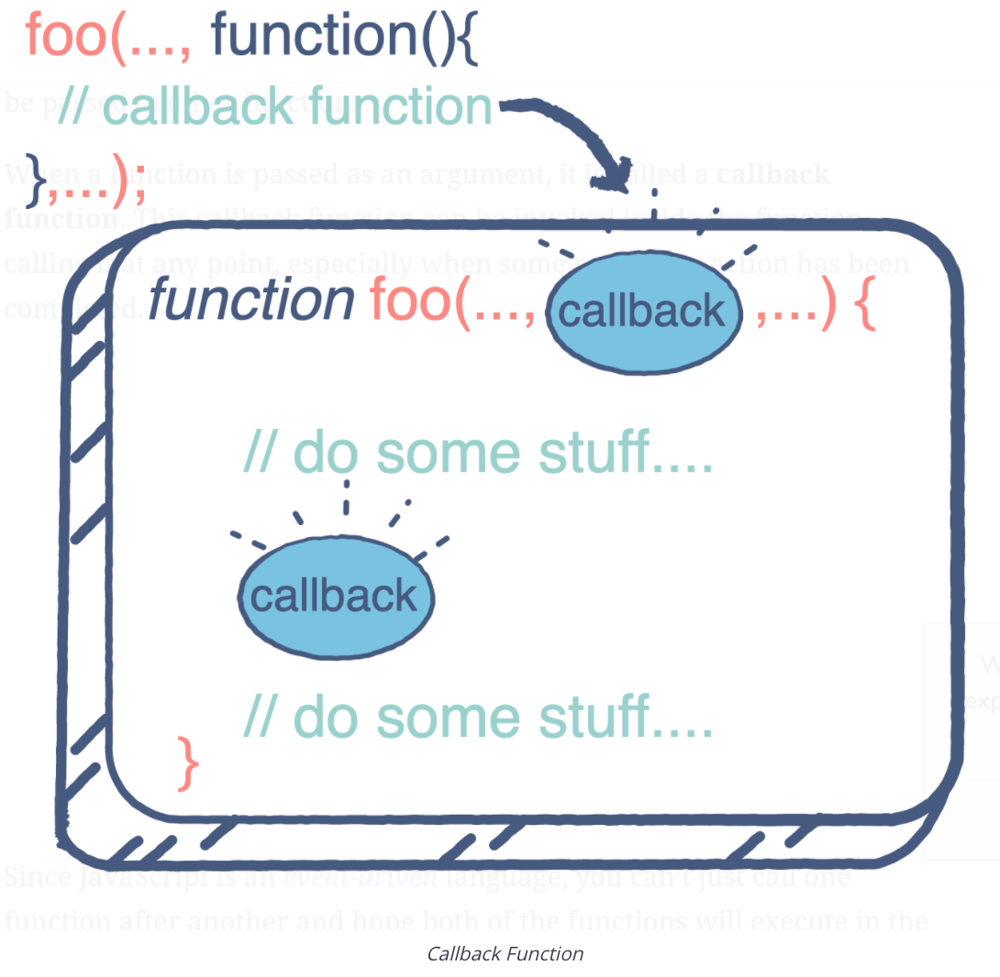

# Callback functions

## Passing function as an argument

Just like almost everything in JavaScript (except primitive data types), functions are an object type. So like any other object type, functions can be passed to other functions.

The foo( ) function takes another function as a parameter and calls it inside. This is valid in JavaScript and we call it a “callback”. So a function that is passed to another function as a parameter is a callback function.



## An Example

Have a look at the code given below.

```javascript
function calculateSum(n, callback) {
  var i;
  var sum = 0;
  for (i = 1; i <= n; i++) {
    sum += i;
  }
  console.log(`Sum is: ${sum}`);
  callback(sum);
}

var n = 10;
calculateSum(n, function(sum){
  console.log(`Average is: ${sum/n}`);
});
```

This is how it’s working:

- **Lines 1-9**: The calculateSum function receives a number n, and a callback function. It sums the numbers from 1 up to n, prints out the calculated sum and passes it to the callback function, as shown on Line 8.

- **Lines 12-14**: When calling the calculateSum function, the callback function has also been defined inside the function call. It takes the sum passed to it by calculateSum and uses that sum to print out the average.

> The callback function can also be defined separately and then passed to the function call.

## Why do we need Callback Functions?

JavaScript runs code sequentially in top-down order. However, there are some cases that code runs (or must run) after something else happens and also not sequentially. This is called asynchronous programming.

Callbacks make sure that a function is not going to run before a task is completed but will run right after the task has completed. It helps us develop asynchronous JavaScript code and keeps us safe from problems and errors.

In JavaScript, the way to create a callback function is to pass it as a parameter to another function, and then to call it back right after something has happened or some task is completed. Let’s see how…

## How to create a Callback?

Let's say we want to log a message to the console but it should be there after 3 seconds.

```javascript
const message = function() {
    console.log("This message is shown after 3 seconds");
}

setTimeout(message, 3000);
```

There is a built-in method in JavaScript called “setTimeout”, which calls a function or evaluates an expression after a given period of time (in milliseconds). So here, the “message” function is being called after 3 seconds have passed. (1 second = 1000 milliseconds)

In other words, the message function is being called after something happened (after 3 seconds passed for this example), but not before. So the message function is an example of a callback function.

## What is an Anonymous Function?

Alternatively, we can define a function directly inside another function, instead of calling it. It will look like this:

```javascript
setTimeout(function() {
    console.log("This message is shown after 3 seconds");
}, 3000);
```

As we can see, the callback function here has no name and a function definition without a name in JavaScript is called an “anonymous function”. This does exactly the same task as the example above.

## Callback as an Arrow Function

If you prefer, you can also write the same callback function as an ES6 arrow function, which is a newer type of function in JavaScript:

```javascript
setTimeout(() => {
    console.log("This message is shown after 3 seconds");
}, 3000);
```

## Video
[https://www.youtube.com/watch?v=qtfi4-8dj9c](https://www.youtube.com/watch?v=qtfi4-8dj9c)
