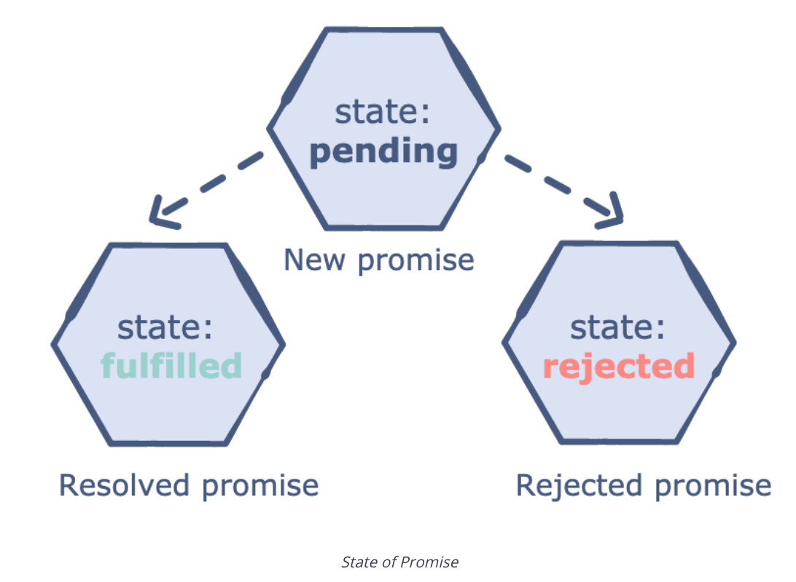

# Promise

## What is a Promise?
A promise in JavaScript is similar to a promise in real life. When we make a promise in real life, it is a guarantee that we are going to do something in the future. Because promises can only be made for the future.

A promise has 2 possible outcomes: it will either be kept when the time comes, or it won’t.

This is also the same for promises in JavaScript. When we define a promise in JavaScript, it will be resolved when the time comes, or it will get rejected.

## Promises in JavaScript

First of all, a Promise is an object. There are 3 states of the Promise object:

- **Pending**: is the initial state.
- **Resolved**: indicates that the promised operation was successful.
- **Rejected**: indicates that the promised operation was unsuccessful.​



For example, when we request data from the server by using a Promise, it will be in pending mode until we receive our data.

If we achieve to get the information from the server, the Promise will be resolved successfully. But if we don’t get the information, then the Promise will be in the rejected state.

## Creating a simple promise

1. A promise is created using a constructor that takes a call back function with two arguments (line 1).
2. The code needed to perform the promised task is written. In this example, it is assumed that the code executes successfully (line 2).
3. If the task is successful, the promise is resolved. In this example, the optional parameter “The promised task was performed successfully” is passed (lines 4-5).
4. If the task is unsuccessful, then the promise is rejected. In this example, an optional parameter is passed (lines 6-7).
5. The then() method is called when the promise is resolved, ​and the catch() method is called if the promise is rejected or if there was an error during the code execution (lines 10-11).

```javascript
let promise = new Promise((resolve, reject) => {
  // Code to perform the promised task
  let task_performed = true;
  if(task_performed) {
    resolve('The promised task was performed successfully.');
  } else {
    reject('The promised task was not performed.');
  }
});
promise.then((fromRes) => console.log(fromRes)).
  catch((fromRej) => console.log(fromRej));
```

## Using Promise.all()

The **Promise.all()** method returns a single promise that resolves when all of the passed-in promises have resolved. It rejects if one of the promises is rejected.

```javascript
let promise1 = new Promise((resolve, reject) => {
  resolve(1);
});
let promise2 = new Promise((resolve, reject) => {
  setTimeout(resolve, 1000,2);
});
Promise.all([promise1, promise2]).then( () => {
  console.log("Both the promises have been resolved successfully.");
});
```

## Using Promise.race()

The **Promise.race()** method returns a promise that resolves or rejects as soon as one of the promises resolves or rejects. The **fromRes** method​ contains the value from the promise that is resolved first.

```javascript
let promise1 = new Promise((resolve, reject) => {
  setTimeout(resolve(2), 100);
});
let promise2 = new Promise((resolve, reject) => {
  resolve(1);
});
Promise.race([promise1, promise2]).then((fromRes) => {
  console.log(fromRes);
});
```
