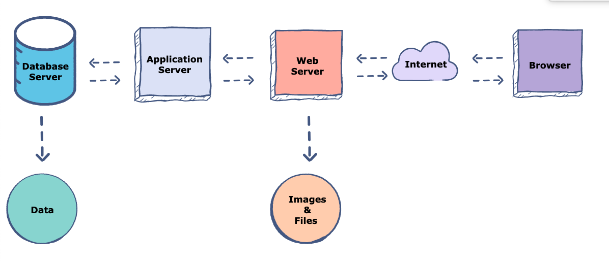
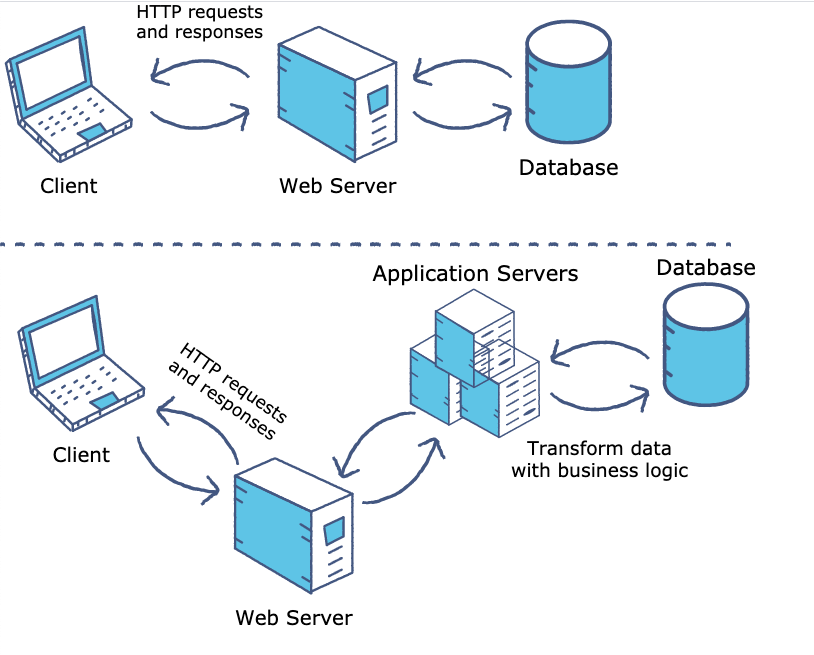

# Web App Architecture

## 1. What is a Web App?

A web application is a program that runs remotely and can be accessed through any web browser. It is a combination of client-side and server-side scripts that handle how data is stored, retrieved, and displayed to the user.

People often confuse web applications and websites as being the same but actually, the two are quite different.

A website focuses more on just displaying the content – usually the same content to all users. A web app, on the other hand, does more than just display the content; it also allows users to perform actions by interacting through web pages with the server.




### Types of web applications
The two main types of web applications are:

- Dynamic: Require server-side processing to input your data and show you the relevant information.
- Static: Do not require any server-side processing.

### Examples
Some of the more popular examples of web applications include things like Google Docs, DropBox, and Spotify.

### 2. Web Server versus Application Server

A **web server** accepts and fulfills requests from clients for static content (i.e., HTML pages, files, images, and videos) from a website. Web servers handle HTTP requests and responses only.

An **application server** exposes business logic to the clients, which generates dynamic content. It is a software framework that transforms data to provide the specialized functionality offered by a business, service, or application. For example, application servers, like the Apache Tomcat, power the interactive parts of a website that can appear differently depending on the context of the request.

The illustration below highlights the difference in their architecture:



The columns below summarize the key differences between the two types of servers:

| Web Server          | Application Server      |
|---------------------------|-----------------------|
| Deliver static content.| Delivers dynamic content.|
|Content is delivered using the HTTP protocol only.| Provides business logic to application programs using several protocols (including HTTP).|
|Serves only web-based applications.|Can serve web and enterprise-based applications.|
|No support for multi-threading.| Uses multithreading to support multiple requests in parallel.|
|Facilitates web traffic that is not very resource intensive.| Facilitates longer running processes that are very resource-intensive​.|

## 3. HTTP

Read this article on Mozilla Developer Network.
[https://developer.mozilla.org/en-US/docs/Web/HTTP/Overview](https://developer.mozilla.org/en-US/docs/Web/HTTP/Overview)

## 4. Choosing a HTTP Response Code

1. [Use this flowchart to decide what status code to use and when](https://www.codetinkerer.com/2015/12/04/choosing-an-http-status-code.html)
2. [Commonly used Response Codes with Discussion](https://www.bigbinary.com/conversation)

## 6. HTTP Drills I

Go through the following link to learn the basics of the node `http` standard library.
[https://flaviocopes.com/node-module-http/](https://flaviocopes.com/node-module-http/)

Create a new project in Gitlab, the naming format is `<first_name>-http-server`. Write a program which will start a static server, and which would satisfy the following requests:


- **GET /html** - Should return the following HTML content. Note when opened in the browser it should display the HTML page and not the HTML code.
```
<!DOCTYPE html>
<html>
  <head>
  </head>
  <body>
      <h1>Any fool can write code that a computer can understand. Good programmers write code that humans can understand.</h1>
      <p> - Martin Fowler</p>

  </body>
</html>
```
- **GET /json** - Should return the following JSON string
```
{
  "slideshow": {
    "author": "Yours Truly",
    "date": "date of publication",
    "slides": [
      {
        "title": "Wake up to WonderWidgets!",
        "type": "all"
      },
      {
        "items": [
          "Why <em>WonderWidgets</em> are great",
          "Who <em>buys</em> WonderWidgets"
        ],
        "title": "Overview",
        "type": "all"
      }
    ],
    "title": "Sample Slide Show"
  }
}
```
- **GET /uuid** - Should return a UUID4. For example:
```
{
  "uuid": "14d96bb1-5d53-472f-a96e-b3a1fa82addd"
}
```
- **GET /status/{status_code}** - Should return a response with a status code as specified in the request. For example:
    - /status/100 - Return a response with 100 status code
    - /status/500 - Return a response with 500 status code

  Try it out for 100,200,300,400,500.

- **GET /delay/{delay_in_seconds}** - Should return a success response but after the specified delay in the request. For example: If the request sent is GET /delay/3, then the server should wait for 3 seconds and only then send a response with 200 status code.
