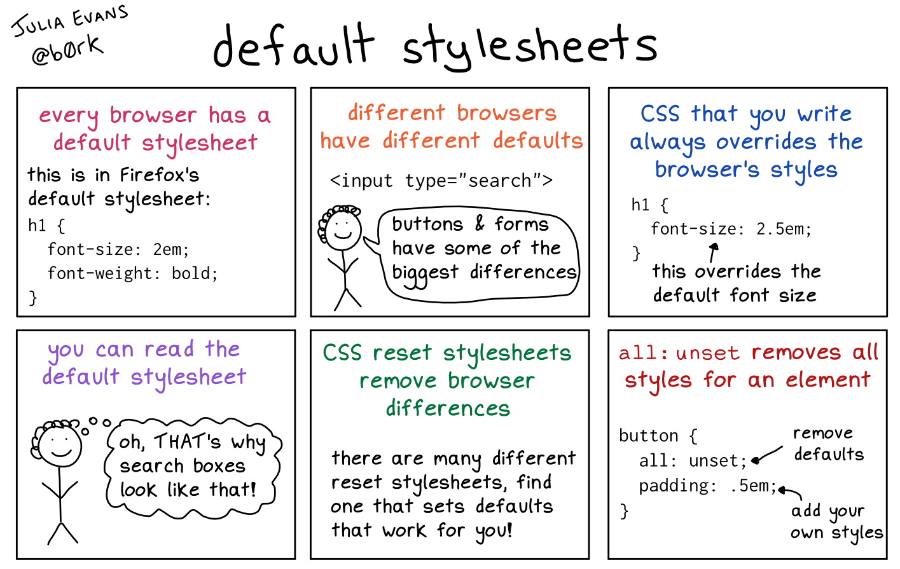

# HTML and CSS Basics

## Do any 1 Tutorial

- [https://www.udacity.com/course/intro-to-html-and-css--ud001](https://www.udacity.com/course/intro-to-html-and-css--ud001)
- [https://dash.generalassemb.ly/](https://dash.generalassemb.ly/)
- [https://learn.shayhowe.com/](https://learn.shayhowe.com/)
- [https://marksheet.io/](https://marksheet.io/)
- [https://www.internetingishard.com/html-and-css/](https://www.internetingishard.com/html-and-css/)

## CSS Selectors

- [https://www.educative.io/edpresso/what-are-css-selectors](https://www.educative.io/edpresso/what-are-css-selectors)
- [https://css-tricks.com/how-css-selectors-work/](https://css-tricks.com/how-css-selectors-work/)

## Box Model

[https://css-tricks.com/the-css-box-model/](https://css-tricks.com/the-css-box-model/)

## Flexbox

Resources:
- [CSS Flex Video](https://www.youtube.com/watch?v=JJSoEo8JSnc)
- [https://css-tricks.com/snippets/css/a-guide-to-flexbox/](https://css-tricks.com/snippets/css/a-guide-to-flexbox/)

Play the games to practice:
- [https://flexboxfroggy.com/](https://flexboxfroggy.com/)
- [http://www.flexboxdefense.com/](http://www.flexboxdefense.com/)

## Default Browser Styles

This is a zine by Julia Evans.

## Layout Drills

[https://gitlab.com/mountblue/js/css-layout-drills](https://gitlab.com/mountblue/js/css-layout-drills)

Create a [codepen](https://codepen.io/) collection with solutions for all problems and submit the Codepen collection URL

NOTE: Each problem can have multiple solutions. Also, ignore the `div` numbers, they have been used for illustrations only.

## Pricing Page Project

**Instructions**
- Fork this repository:
[https://gitlab.com/mountblue/js/pricing-html-css](https://gitlab.com/mountblue/js/pricing-html-css)
- Clone it in your local machine
- **Make regular commits to your project**

### Optionally use reset.css
