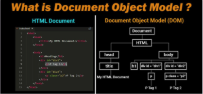

# DOM

## 1. What is DOM?

- Programming interface for HTML
- A representation of HTML that can be accessed using Javascript

#### How does it get created?

- When a web page is loaded, the browser creates the DOM for that specific page
- This allows for the creation of dynamic web pages where users can interact with the page

#### DOM under the hood
The structure of the DOM uses something called a tree, where the topmost node is the ***document*** object.



#### Using the *document* object

- the ***document*** object represents the web page that has been loaded
- it acts as the “starting point” for access to the DOM.

#### The things we can do with the ***document*** object
- Finding Elements
- Creating new elements
- Updating elements
- Changing properties of an elements
- Listening to events like click, hover, etc

### Element Selection in DOM

#### How to select elements in DOM

To access the DOM, we make use of the document object.

This object has properties and functions that we use to access our HTML elements which we can manipulate with JavaScript by using some available methods discussed below.

#### Available Methods:
- **getElementById:**

     **getElementById** accepts a string which is the name of an ***id*** in the DOM and it finds the first matching id.

     ```
       document.getElementById("div1");
     ```
    We get back a special object called an **HTMLElement**.

   The exact kind of object we get back will depend on what we select (for instance, it will be an **HTMLDIVElement** if we refer to the above image)

- **getElementsByTagName**

  **getElementsByTagName** accepts a string which is the ***HTML tags*** (like div, p, a, li, ul etc) in the DOM.

  It returns a list of all of the elements that match the string passed to the function
     ```
       document.getElementByTagName("p");
     ```
  This function returns an **HTMLCollection** to us!

  It looks a lot like an array, and you can access it at a specific index or use a for loop

  However, you can not use common methods like ***push***, ***pop***, ***indexOf*** or ***includes***

- **getElementsByClassName**

   **getElementsByClassName** accepts a string which is the name of an element in the DOM.

  It returns a list of all of the elements that have a class attribute, which matches the string passed to the function

   ```
   document.getElementsByClassName("p2");
   ```

   Just like *getElementsByTagName*, we get back a special kind of array called an HTMLCollection.

  Read more about [HTMLCollection](https://developer.mozilla.org/en-US/docs/Web/API/HTMLCollection)

- **querySelector**

   **querySelector** accepts a string that is a valid CSS selector (I hope you remember them!!!).
   It returns the **first element** that matches the CSS selector passed to the function

   ```html
   document.querySelector("#div1");

   document.querySelector("p.p2");
   ```

   Just like *getElementById*, this function returns a special HTMLElement object to us.


- **querySelectorAll**


   **querySelectorAll** accepts a string that is a valid CSS selector.
It returns **all the elements** that matches the CSS selector passed to the function.
   ```
   document.querySelectorAll("div");

  document.querySelectorAll("ul .nav-links");
   ```

   This function returns a **NodeList** to us!

  It looks a lot like an array, and you can access it at a specific index or use a for loop

   However, you can not use common methods like ***push***, ***pop***, ***indexOf*** or ***includes***

  It’s almost identical to an HTMLCollection except it can include special kinds of nodes.

  Read more about [NodeList](https://developer.mozilla.org/en-US/docs/Web/API/NodeList)


[Difference b/w NodeList & HTMLCollection](https://dev.to/jharteaga/difference-between-htmlcollection-and-nodelist-25bp)

#### Crash Course

Check out the below playlist.
[https://www.youtube.com/watch?list=PLillGF-RfqbYE6Ik_EuXA2iZFcE082B3s&v=0ik6X4DJKCc](https://www.youtube.com/watch?list=PLillGF-RfqbYE6Ik_EuXA2iZFcE082B3s&v=0ik6X4DJKCc)

## 2. DOM Manipulation

### Modifying Elements in the DOM

#### Accessing Text

The easiest way to access the text of an element is to use ***innerText***

```html
<section id="greeting">
  <article>Hello World!</article>
</section>
```
```js
const greeting = document.getElementById("greeting")

console.log(greeting.innerText) // "Hello World!"
```

#### Modifying Text

If you need to change any text, you can assign a new value to the innerHTML:
```js
const greeting = document.getElementById("greeting")

greeting.innerText = "It's changed !!!"
```

#### Using textContent

Another common way to access and modify text is to use the ***textContent*** property
```js
const greeting = document.getElementById("greeting")

greeting.textContent = "It's changed !!!"
```
<br/>

**So what’s the difference?**

There are quite a few small differences:

- innerText is aware of the rendered appearance of text, while textContent is not.
- textContent gets the content of all elements, including `<script>` and `<style>` elements. In contrast, innerText only shows “human-readable” elements.
- depending on the complexity of the content inside an element, innerText can be a bit less performant that textContent
- for now, you can use either, but be aware that both exist!

#### Accessing HTML

If you need to access the HTML of an element, you can use innerHTML. This will include all the elements inside of the one you select.

```html
<section id="greeting">
  <article>Hello World!</article>
</section>
```
```js
const greeting = document.getElementById("greeting")

console.log(greeting.innerHTML) // "<article>Hello World!</article>"
```
You will find yourself using innerText more commonly, there are some security concerns when using innerHTML if you’re not careful.

#### Modifying HTML

If you need to change any HTML, you can assign a new value to the innerHTML, just like you did with innerText:

```js
const greeting = document.getElementById("greeting")

greeting.innerHTML = "<article>It's Changed!!!</article>"
```

Another reason it’s less common to use innerHTML is that you need the string to be valid HTML for everything to work, which can be quite tedious and more error-prone to build

#### Modifying styling

Aside from the text or HTML of an element, it’s very common that you’ll want to change the inline style for an element.

You can access any inline CSS properties on an element using the ***style*** property

```html
<h1 style="color: black; background-color: red;">
  Welcome to MountBlue!!!
</h1>
```
```js
const mainHeading = document.querySelector("h1")

mainHeading.style.color // "black"
```
To change the style, simply reassign the value of the CSS property
```js
const mainHeading = document.querySelector("h1")

mainHeading.style.color = "red
```
<br/>

**How about background color?**

Let’s go and change the background-color CSS property:
```js
const mainHeading = document.querySelector("h1")

console.log(mainHeading.style.background-color) //Error!
```
<br/>

Weird !!! Isn't it...

It was working fine for `color` property, but throwing error for `background-color` property, why????

It's because of ***Hyphen("-")*** sign, and it will apply to all the properties having a hyphen in their names, so, instead, remove the hyphen and join the word in **camelCase format**, i.e., `background-color` will become `backgroundColor`


### Modifying Attributes

So far you’ve seen how to modify HTML and text.

The third most common thing you’ll be modifying are **attributes** for an element

To do that, we can get attributes using **getAttribute** and modify attributes using **setAttribute**

#### Attributes

Attributes are part of every HTML element that modify an HTML element.

An attribute either modifies the default functionality of an element type or provides functionality.

- src
- href
- class
- id
- type
- value

Read more about [Attributes](https://www.tutorialrepublic.com/html-tutorial/html-attributes.php#:~:text=Attributes%20define%20additional%20characteristics%20or,be%20enclosed%20in%20quotation%20marks.)

#### getAttribute

In order to access an attribute on an element, you can use the ***getAttribute*** method
```js
const firstInput = document.querySelector("input")

firstInput.getAttribute("type") // "text"
```

#### setAttribute

To set an attribute on an element, you can use the ***setAttribute*** method
```js
const firstInput = document.querySelector("input")

firstInput.setAttribute("type", "email") // "email"
```

#### Direct attribute access

There are a few attributes that you can directly access and modify as well instead of having to use getAttribute or setAttribute.

One of those is ***id***
```html
<input type="text" id="first-name">
```
```js
const firstInput = document.querySelector("input")

firstInput.id // "first-name"

firstInput.id = "full-name" // changes the attribute
```
A more common one you will use is the ***value*** attribute with forms in HTML
```html
<input type="text">
```
```js
const firstInput = document.querySelector("input")

firstInput.value // ""

firstInput.value = "Just added some value!" // changes the attribute
```

### Manipulating classes

We have quite a few ways to manipulate the ***class*** attribute in JavaScript:

- ***setAttribute(“class”)*** - this will override the class
- ***className*** - this will give you a string representation of the class
- ***classList*** - this will give you an array-like object to add, remove or toggle classes

#### setAttribute(“class”)

If you want to access the class attribute you can use ***getAttribute(“class”)*** or the ***className*** property.
```js
const mainHeading = document.querySelector("h1")

mainHeading.setAttribute("class", "section-heading");
```
this works but will overwrite the previous class

#### className
You can also add a class by reassigning the className property
```js
const mainHeading = document.querySelector("h1")

mainHeading.className += " top-heading" // works, but is prone to bugs
```

#### classList
An easier way to interact with classes on an element is to use the ***.classList*** method
```js
const mainHeading = document.querySelector("h1")

mainHeading.classList // []

mainHeading.classList.add("top-heading") // ["top-heading"]

mainHeading.classList.remove("top-heading") // []

mainHeading.classList.toggle("top-heading") // true

mainHeading.classList.contains("top-heading") // true
```

### Changing Multiple Elements
Now that you’ve seen how to modify styles, attributes, and text. How can we modify multiple elements at once?
```js
const listItems = document.querySelectorAll("li");

// let's change them all to green!

listItems.style.color = "green"
//  TypeError: Cannot set property 'color' of undefined
```
<br />

**How it's done ???**

To do this we need to loop over multiple elements!
```js
const listItems = document.querySelectorAll("li");

for(let listItem of listItems){
  listItem.style.color = "red";
}
```

### Working with the Dom

#### Creating Elements

To create an HTML element, we can use the ***createElement*** function and pass in the name of the element

This just makes an empty element, so if we want to add any text, attributes or styling we will have to do that on another line
```js
const newButton = document.createElement("button");

const newUnorderedList = document.createElement("ul");

const newDiv = document.createElement("div");

newDiv.innerText = "a brand new div!"

newDiv.style.color = "red"
```

#### Appending Elements

After you create an element, you need to place it in the DOM to see it. You can do this using the ***append*** method.

***append*** is a method that a parent element calls and you pass in the child element that you would like to place inside of the parent element.
```js
const ul = document.querySelector("ul");

const newLi = document.createElement("li");

newLi.innerText = "Hello!";

ul.append(newLi);
```

**Note:** append will place the element as the last child in the parent. If you would like the element to be the first child, you can use the ***prepend*** method.

#### Removing Elements

If we want to remove elements in the DOM, we can use the handy ***remove*** method.

In order to remove an element, we first need to find it.
```js
const ul = document.querySelector("ul");

ul.remove();
```
This function can only be called on a single element, so if you need to remove multiple elements you’ll need to call ***remove*** multiple times.

### Finding elements near another element

As you start adding and removing elements in the DOM, there are times where you might want to know not only information about an element, but it’s parents or children.

You might want to:

- find an element and remove some or all of its children
- find an element and add an element to one of its children

Thankfully there are some very helpful methods for doing just that!

#### Setting the stage with some HTML
```html
<!DOCTYPE html>
<html>
<body>
  <section>
    <h1>Here is a main heading!</h1>
    <div>
      <p>
        Here is a paragraph inside a div!
      </p>
      <ul>
        <li>First list item in a div</li>
        <li>Second list item in a div</li>
      </ul>
    </div>
    <div>Here is the second div!</div>
  </section>
  <script src="script.js"></script>
</body>
</html>
```

Take a look at some parent, child, and sibling element relationships.

We will be focusing specifically on the `<div>` element.

#### Accessing a parent element
If you want to access the parent element of another element, you can use the ***parentElement*** method.
```js
const foundDiv = document.querySelector("div")

foundDiv.parentElement // <section></section>
```
#### Accessing the children of an element
If you want to access the child elements of another element, you can use the ****children**** method.
```js
foundDiv.children //HTMLCollection(2) [p, ul]
foundDiv.firstElementChild //<p>Here is a paragraph inside a div!</p>
foundDiv.lastElementChild // <ul></ul>
```

#### Accessing the siblings of an element
If you want to access the previous sibling or next sibling element of another element, you can use the ***previousElementSibling*** or ***nextElementSibling*** method.
```js
foundDiv.previousElementSibling // <h1>Here is a main heading!</h1>
foundDiv.nextElementSibling // <div>Here is the second div!</div>
```

#### Text Nodes

You may come across other methods for finding things in the DOM, we have shown you the most common ones, but as you learn more you may come across something called a ***text node***

More about [Text Node](https://stackoverflow.com/questions/17195868/what-is-a-text-node-its-uses-document-createtextnode)

### Nodes VS Elements
- With some of these finder methods, you will see that you don’t always get back an HTML element, you sometimes get back what is called a text node
- Everything in the DOM is a **node**, some nodes are not actually HTML elements, but text or even comments!
- With most of the common traversal methods, you will not need to worry about text nodes
- You will be using other methods less frequently, but know that they exist if you need to see elements near/above/below the element you find.

Know more about [NodeTypes](https://developer.mozilla.org/en-US/docs/Web/API/Node/nodeType)

Video - [https://www.youtube.com/watch?v=mPd2aJXCZ2g](https://www.youtube.com/watch?v=mPd2aJXCZ2g)

## 3. Javascript Events

#### What is an event???
DOM events are “actions” that occur as a result of something the user or the browser does.

We can use JavaScript to execute code when these kinds of “events” happen.

#### What Kinds Of Events Do We Have???
- clicking on something
- hovering over something with the mouse
- pressing certain keys
- when the DOM has loaded
- when a form is submitted

We write code that listens for events - and react accordingly!

This is commonly called [Event Driven Programming](https://www.valentinog.com/blog/event/)

#### How do we do it???
We have three options:

- Attach the name of the function to the element in HTML
- Attach the name of the function to an element in JavaScript
- Use the addEventListener method

**Attaching The Name Of The Function**
```html
<h1 onclick="runClickHandler()"> Hello World </h1>
```
```js
function runClickHandler(){
  console.log("You just clicked the h1 element!";
})
```
<br />

**Adding in Javascript**
```js
const h1 = document.querySelector("h1");

h1.onclick = function(){
  console.log("You just clicked the h1 element!";
}
```
<br />

**Using addEventListener**
```js
const h1 = document.querySelector("h1");

h1.addEventListener("click", function(){
  console.log("You just clicked the h1 element!";
})
```

#### Which One Should We Use???
We’re going to go with addEventListener - here’s why:

- It gives us the most flexibility around our event listeners
- It avoids writing any inline code in our HTML and keeps our HTML and JS separate
- This is commonly called “Separation of Concerns”

#### Important: Waiting For The Dom To Load!!!
If you are trying to access properties in the DOM, before the web page has loaded - it won’t work! This becomes an issue if you put `<script>` tags in the `<head>` before the DOM has loaded

Thankfully we have an event we can listen for, to handle this! It’s called ***DOMContentLoaded***
```js
document.addEventListener("DOMContentLoaded", function(){
  // place your code inside here
})
```

#### Accessing The Event Object

Inside of the callback to addEventListener, we get access to a special object as a parameter - the event object
```js
const h1 = document.querySelector("h1");

// we can call this parameter whatever we want - event is very common
h1.addEventListener("click", function(event){
  console.log(event)
})
```

#### What Is Inside Of The Event Object?

- target - what element is the target of the event
- pageX / pageY - where on the page did this event occur?
- key - what key was pressed that triggered this event?
- [preventDefault()](https://developer.mozilla.org/en-US/docs/Web/API/Event/preventDefault) - a function used to prevent the default behavior of the event.
  - This is **very useful** for stopping form submissions from refreshing the page which is their default behavior

```html
<form>
  Name: <input id="firstName" type="text">
  <button>Add your name!</button>
</form>
```
```js
const formElement = document.querySelector("form");

formElement.addEventListener("submit", function(event){
  console.log("you just submitted the form!")
})
```
Unfortunately, this will not work! The default behavior of a form is to trigger a refreshing of the page.

**Solution:**

If we want to stop the default behavior of an event, we need to use the special ***event.preventDefault()*** method.
```js
const formElement = document.querySelector("form");

formElement.addEventListener("submit", function(event){
  event.preventDefault();
  console.log("you just submitted the form!");
})
```
<br />

**Another Example**

So far we’ve seen click and submit, events - let’s take a look at another one, keyPress!
```html
<!DOCTYPE html>
<html>
<body>
  <h1>Press the "a" key!</h1>
  <script src="script.js"></script>
</body>
</html>
```
```js
// listen for the keypress everywhere
document.addEventListener("keypress", function(event) {
  if (event.key === "a") {
    alert("you just pressed the 'a' key!");
  }
});
```

### Adding Multiple Event Listeners
It’s very common that you will want to add multiple event listeners on elements

Let’s see an example:
```html
 <body>
    <h1>See your friend list!</h1>
    <ul id="friend-list">
      <li>Thor <button>Remove</button></li>
      <li>Iron-man <button>Remove</button></li>
      <li>Captain America <button>Remove</button></li>
    </ul>
    <script src="myscript.js"></script>
  </body>
```
```js
const buttons = document.querySelectorAll("button");

for (let button of buttons) {
  button.addEventListener("click", function(event) {
    event.target.parentElement.remove();
  });
}
```
Everything seems to be working!

**What happens when we want to add new elements?**
```html
<body>
    <h1>See your friend list!</h1>
    <ul id="friend-list">...</ul>
    <form>
      <label for="first-name"></label>
      <input type="text" id="first-name" />
      <button>Add a friend!</button>
    </form>
    <script src="script-form.js"></script>
  </body>
```
```js
const form = document.querySelector("form");
const friendList = document.querySelector("#friend-list");

const buttons = document.querySelectorAll("li button");

for (let button of buttons) {
  button.addEventListener("click", function(event) {
    event.target.parentElement.remove();
  });
}

form.addEventListener("submit", function(event) {
  event.preventDefault();
  const newFriendInput = document.querySelector("#first-name");
  const newLi = document.createElement("li");
  const newButton = document.createElement("button");
  newLi.innerText = newFriendInput.value;
  newButton.innerText = "Remove";

  newLi.append(newButton);
  friendList.append(newLi);
  form.reset();
});
```
<br />

**It doesn’t work!!!**

The issue here is that our event listener only works for elements **currently** on the page

There are two ways we can fix this:

- Adding the event listener when we create elements
- Event Delegation

Let’s start with adding an event listener when we create

**Adding the listener when we create**
```js
const form = document.querySelector("form");
const friendList = document.querySelector("#friend-list");

form.addEventListener("submit", function(event) {
  event.preventDefault();
  const newFriendInput = document.querySelector("#first-name");
  const newLi = document.createElement("li");
  const newButton = document.createElement("button");
  newLi.innerText = newFriendInput.value;
  newButton.innerText = "Remove";

  newButton.addEventListener("click", function(event) {
    event.target.parentElement.remove();
  });

  newLi.append(newButton);
  friendList.append(newLi);
  form.reset();
});
```
This will work, but it’s not the most efficient approach

We’re adding an event listener for every single button inside of each `<li>`

This means if we had 1,000,000 friends, we’d have 1,000,000 listeners!

We can fix this using **event delegation**

#### Event Delegation
The idea behind event delegation is that we make a parent element the “delegate”

In our case, the parent element is the `<ul>` element

We attach a single event listener on the parent or delegate element and then if the event happens inside a certain child element, we can access that child element using event.target

**How to do better using event delegation**
```js
friendList.addEventListener("click", function(event) {
  if (event.target.tagName === "BUTTON") {
    event.target.parentElement.remove();
  }
});
```
Exact same behavior with only one event listener!

#### Event Bubbling And Capturing
The process of an event moving from the place it is clicked to its target is called **capturing**

When an event happens on an element, it first runs the handlers on it, then on its parent, then all the way up on other ancestors.

This is called **bubbling**.

Read more on [Event Bubbling and Capturing](https://medium.com/@vsvaibhav2016/event-bubbling-and-event-capturing-in-javascript-6ff38bec30e)

### Removing Event Listeners
Sometimes after you add an event listener, you will want to remove it.

Some examples of this include:

- A game is over and no more events should be registered
- You can no longer drag and drop something into a part of the page
- You do not want the user submitting any more information

<br />

**How it works**

We can use the removeEventListener function to remove any event listeners

This **can not** be called on multiple elements
```js
let buttons = document.getElementsByTagName("button");

buttons.removeEventListener("click", function(){
  alert("You just clicked a button");
});
```
The code above will not work!!!

Maybe we can just add it to an element individually like this:
```js
for(let button of buttons){
  button.removeEventListener("click", function(){
    alert('You just clicked on a button!');
  });
}
```

But this won’t work either!!! :P

**Removing Event Listeners Correctly**

removeEventListener needs a reference to the name of the function to remove
```js
function alertData(){
  alert("You just clicked a button");
}

for(let button of buttons){
  button.removeEventListener("click", alertData);
}
```
**Note:** anonymous functions will not work here!

### Data attributes
When creating elements and HTML pages, it’s very common that you might want to add some metadata or additional information about elements

These are not things that the user should see, but accessible information in CSS and JavaScript

Instead of placing this in ***id*** or ***class***, we can create custom attributes called **data attributes**

These attributes start with data- and then anything you would like. You can read them easily in CSS and JavaScript

**Example:**
```html
<!DOCTYPE html>
<html lang="en">
<body>
  <ul id="cars">
    <li data-model="model 3" data-year="2014">Tesla</option>
    <li data-model="crv" data-year="2017">Honda</option>
    <li data-model="focus" data-year="2011">Ford</option>
    <li data-model="prius" data-year="2015">Toyota</option>
  </ul>
  <script src="script.js"></script>
</body>
</html>
```
```js
const ul = document.querySelector("ul");

ul.addEventListener("click", function(event) {
  const selectedElement = event.target;
  console.log("see all data attributes", selectedElement.dataset);
  console.log(
    "see one data attribute",
    selectedElement.getAttribute("data-model")
  );
});
```
<br />

Read more about [Data attributes](https://css-tricks.com/a-complete-guide-to-data-attributes/)

## 4. Web Storage APIs

The **Web Storage API** provides mechanisms by which browsers can store key/value pairs, in a much more intuitive fashion than using cookies.

Video - [https://www.youtube.com/watch?v=MOd5cTJ6kaA](https://www.youtube.com/watch?v=MOd5cTJ6kaA)

### Introduction
- [https://flaviocopes.com/web-platform/](https://flaviocopes.com/web-platform/)
### Web storage
- [https://flaviocopes.com/web-storage-api/](https://flaviocopes.com/web-storage-api/)
- [https://javascript.info/data-storage](https://javascript.info/data-storage)
### Cookies vs localStorage vs sessionStorage
- [https://www.youtube.com/watch?v=AwicscsvGLg](https://www.youtube.com/watch?v=AwicscsvGLg)

## 5. Important Concepts to Understand
- Why using alert and prompt is bad practice
- Difference in Node and Elements in HTML - [https://stackoverflow.com/questions/9979172/difference-between-node-object-and-element-object](https://stackoverflow.com/questions/9979172/difference-between-node-object-and-element-object)
- Event lifecycle in JS DOM (Bubbling and Capture) - [https://medium.com/prod-io/javascript-understanding-dom-event-life-cycle-49e1cf62b2ea](https://medium.com/prod-io/javascript-understanding-dom-event-life-cycle-49e1cf62b2ea)
