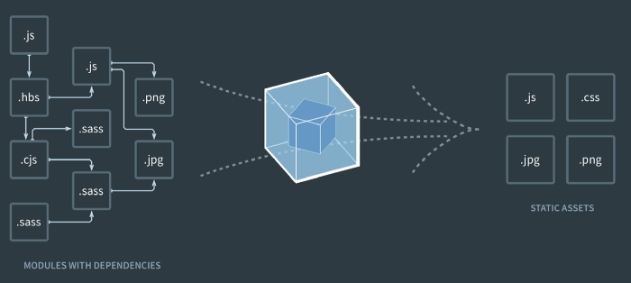

# React

## Prerequisites

- JS Library vs Framework
- Client side frameworks - [https://developer.mozilla.org/en-US/docs/Learn/Tools_and_testing/Client-side_JavaScript_frameworks](https://developer.mozilla.org/en-US/docs/Learn/Tools_and_testing/Client-side_JavaScript_frameworks)
- Webpack - [https://ui.dev/webpack/](https://ui.dev/webpack/)
- Polyfills - [https://ui.dev/compiling-polyfills/](https://ui.dev/compiling-polyfills/)
- Babel - [https://babeljs.io/repl](https://babeljs.io/repl)
- Classes
  - [Class basic syntax](https://javascript.info/class)
  - [Class inheritance](https://javascript.info/class-inheritance)

### Babel & Webpack with React

Go through the following articles for a good understanding of the topic. You do not need to implement anything.

- [JavaScript Transpilers: What They Are & Why We Need Them](https://scotch.io/tutorials/javascript-transpilers-what-they-are-why-we-need-them)
- [Babel and Webpack’s Role in create-react-app](https://medium.com/@imrobinkim/babel-and-webpacks-role-in-create-react-app-3a827ad460a2)
- [Using Create React App to Make React Applications](https://scotch.io/starters/react/using-create-react-app-to-make-react-applications)

Optional Advanced Read:
[An intro to Webpack: what it is and how to use it](https://www.freecodecamp.org/news/an-intro-to-webpack-what-it-is-and-how-to-use-it-8304ecdc3c60/)

## ReactJS

### React Tutorials (Do Any One)

- https://scrimba.com/g/glearnreact
- https://tylermcginnis.com/free-react-bootcamp/
- https://reactjs.org/tutorial/tutorial.html (Official React Tutorial)

React JS Crash Course Video - [https://www.youtube.com/watch?v=sBws8MSXN7A](https://www.youtube.com/watch?v=sBws8MSXN7A)

#### Props
Video - [https://www.youtube.com/watch?v=m7OWXtbiXX8](https://www.youtube.com/watch?v=m7OWXtbiXX8)

#### State
Video - [https://www.youtube.com/watch?v=4ORZ1GmjaMc](https://www.youtube.com/watch?v=4ORZ1GmjaMc)

#### Lifecycle methods

Go through the following link:

[React Lifecycle Methods Diagram](https://projects.wojtekmaj.pl/react-lifecycle-methods-diagram/)

Video - [https://www.youtube.com/watch?v=qnN_FuFNq2g](https://www.youtube.com/watch?v=qnN_FuFNq2g)

#### Seperation of Concern (SoC) with React

#### this

- [Meaning of this](http://nicholasjohnson.com/javascript/javascript-for-programmers/exercises/meaning-of-this/)
- [https://ui.dev/this-keyword-call-apply-bind-javascript/](https://ui.dev/this-keyword-call-apply-bind-javascript/)

#### bind

## React Router

- [Routing in React: Simplified](https://dev.to/fimrandev/routing-in-react-simplified-28ma)
- [React Router Introduction](https://css-tricks.com/learning-react-router/)

**React-Router v4:**

- [Introduction](https://scotch.io/courses/using-react-router-4/introduction)
- [Philosophy and Introduction](https://ui.dev/react-router-v4-philosophy-introduction/)
- [And some more](https://css-tricks.com/react-router-4/)

Video - [https://www.youtube.com/watch?v=cKnc8gXn80Q](https://www.youtube.com/watch?v=cKnc8gXn80Q)

#### Quick Start Guide

[https://reactrouter.com/web/guides/quick-start](https://reactrouter.com/web/guides/quick-start)

#### React Router Params

[https://scotch.io/courses/using-react-router-4/route-params](https://scotch.io/courses/using-react-router-4/route-params)

#### React Router Change URL

Using history - [https://scotch.io/courses/using-react-router-4/using-history](https://scotch.io/courses/using-react-router-4/using-history)
